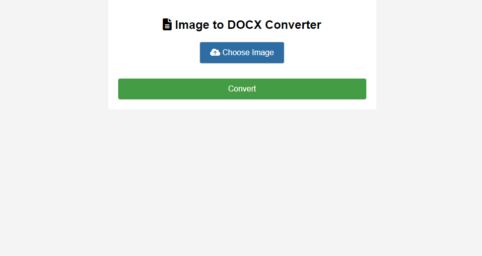

# Image to DOCX Converter

A web application that converts images of documents into editable `.docx` files using Azure Cognitive Services.



## Table of Contents

- [Introduction](#introduction)
- [Features](#features)
- [Prerequisites](#prerequisites)
- [Installation](#installation)
- [Configuration](#configuration)
- [Running the Application](#running-the-application)
- [Accessing the Application](#accessing-the-application)
- [Usage](#usage)
- [Security Considerations](#security-considerations)
- [Troubleshooting](#troubleshooting)
- [License](#license)

## Introduction

This application allows users to upload images of documents and converts them into editable Word documents (`.docx`) using Azure's Optical Character Recognition (OCR) technology.

## Features

- **Image Upload**: Upload images in formats like PNG, JPG, JPEG, BMP, and GIF.
- **OCR Processing**: Extracts text from images using Azure Cognitive Services.
- **DOCX Generation**: Converts extracted text into a Word document.
- **Responsive UI**: Mobile-first design with modern aesthetics.
- **Local Network Access**: Accessible from other devices on your local network.

## Prerequisites

- **Python 3.6+**
- **Azure Account**: An active Azure subscription with a Computer Vision resource.
- **Azure Cognitive Services SDK**: Installed via `pip`.

## Installation

**Step 1**: **Clone the Repository**

```bash
git clone https://github.com/math-alpha/image-to-docx-converter.git
cd image-to-docx-converter
```

**Step 2**: **Create and Activate a Virtual Environment** (Recommended)

```bash
python -m venv venv
# On Windows
venv\Scripts\activate
# On macOS/Linux
source venv/bin/activate
```

**Step 3**: **Install Required Packages**

```bash
pip install -r requirements.txt
```

## Configuration

**Step 1**: **Create a `.env` File**

Create a `.env` file in the project root directory with the following content:

```
AZURE_ENDPOINT=https://your-computer-vision-endpoint.cognitiveservices.azure.com/
AZURE_SUBSCRIPTION_KEY=your_subscription_key
SECRET_KEY=your_secret_key
```

- Replace `https://your-computer-vision-endpoint.cognitiveservices.azure.com/` with your Azure endpoint.
- Replace `your_subscription_key` with your Azure subscription key.
- Replace `your_secret_key` with a secure, random string.

**Step 2**: **Create an `uploads` Directory**

```bash
mkdir uploads
```

## Running the Application

**Using Waitress (Recommended for Windows Users)**

```bash
python app.py
```

- This command starts the application using Waitress (if configured), binding it to all network interfaces on port `5000`.

**Alternative (Development Mode)**

If you want to run the application in development mode (not recommended for production):

1. Ensure the `app.run()` section in `app.py` is active:

    ```python
    if __name__ == '__main__':
        app.run(debug=True, host='0.0.0.0', port=5000)
    ```

2. Run the application:

    ```bash
    python app.py
    ```

**Note for Unix-based Systems**

If you're using a Unix-based system (like Linux or macOS), you can use Gunicorn:

```bash
gunicorn --bind 0.0.0.0:5000 app:app
```

- Ensure you have Gunicorn installed:

  ```bash
  pip install gunicorn
  ```

## Accessing the Application

- **Local Machine**: Open your browser and navigate to `http://localhost:5000` or `http://127.0.0.1:5000`.
- **Other Devices on Local Network**:
  - Find your local IP address (e.g., `192.168.1.x`).
  - On another device connected to the same network, navigate to `http://<your_local_ip>:5000`.

## Usage

1. **Open the Application**: Navigate to the application's URL.
2. **Upload an Image**: Click on "Choose Image" to select an image file.
3. **Convert**: Click on "Convert" to start the OCR process.
4. **Download**: After processing, the browser will prompt you to download the generated `.docx` file.

## Security Considerations

- **Secret Key**: Keep your `SECRET_KEY` and Azure credentials secure. Do not expose them in public repositories.
- **HTTPS**: For production deployment, serve the application over HTTPS.
- **File Handling**: The application restricts allowed file types and securely handles uploads to prevent security risks.
- **Production Server**: Use a production-ready WSGI server (like Waitress or Gunicorn) instead of the Flask development server.

## Troubleshooting

- **Processing Hangs**:
  - Ensure that you have the latest Azure SDK installed.
    ```bash
    pip install --upgrade azure-cognitiveservices-vision-computervision
    ```
  - Verify that your Azure credentials are correct in the `.env` file.
- **Access Issues**:
  - If you cannot access the app from other devices, check your firewall settings and ensure the server is bound to `0.0.0.0`.
- **Error Messages**:
  - Check the console output for any exceptions or error logs.
  - Ensure all required Python packages are installed and up-to-date.
- **Common Errors**:
  - **AttributeError**: Ensure you are using the correct methods compatible with your SDK version.
  - **ImportError**: Verify that all necessary packages are installed.

## License

This project is licensed under the MIT License. See the [LICENSE](LICENSE) file for details.

---

## Testing the App on Local Network

To test the app on your local network:

1. **Ensure the Server is Running**

   ```bash
   python app.py
   ```

2. **Find Your Local IP Address**

   - **Windows**: Open Command Prompt and run `ipconfig`.
   - **macOS/Linux**: Open Terminal and run `ifconfig` or `ip addr`.

3. **Access from Another Device**

   - Connect your device (phone, tablet, another computer) to the same Wi-Fi/network.
   - Open a web browser and navigate to `http://<your_local_ip>:5000`.

4. **Firewall Considerations**

   - Ensure that your firewall allows incoming connections on port `5000`.
   - On Windows, you may need to allow `python.exe` or `waitress-serve` through the firewall.
   - On macOS/Linux, adjust your firewall settings accordingly.

---

## Final Notes

- **Deployment**: For production deployment, consider using a more robust setup with a reverse proxy like Nginx and SSL certificates.
- **Testing**: Test the application thoroughly to ensure all features work as expected.
- **Feedback**: If you encounter any issues or have suggestions, feel free to contribute to the repository or open an issue.
